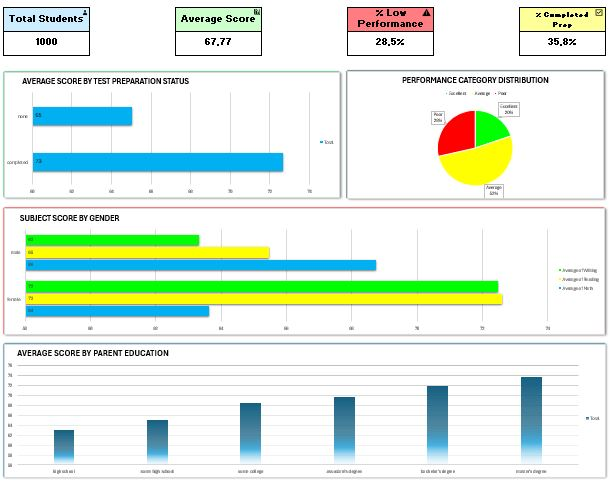

# 🎓 Student Performance Analysis

## 📌 Project Overview
This project analyzes a dataset of student academic performance to identify key factors that influence scores in math, reading, and writing. The dataset is sourced from Kaggle and contains demographic, socioeconomic, and academic data for 1,000 students.

> **Goal:**  
> Discover which factors (e.g., test preparation, gender, parental education) most impact students’ performance, and provide actionable insights for educators and policymakers.

---

## 📂 Dataset Information

- 📁 Source: [Kaggle - Students Performance in Exams](https://www.kaggle.com/datasets/spscientist/students-performance-in-exams)
- 📊 Rows: 1,000 students
- 📋 Columns:
  - `gender`
  - `race/ethnicity`
  - `parental level of education`
  - `lunch`
  - `test preparation course`
  - `math score`
  - `reading score`
  - `writing score`

---

## 🔍 Steps Followed (Data Analysis Lifecycle)

### 1. **Ask**
- Why do some students perform poorly in academic exams?
- What external or demographic factors impact academic performance?

### 2. **Prepare**
- Cleaned missing values (none found)
- Added new columns:
  - `Average Score`: mean of math, reading, writing
  - `Performance Category`: Classified as Excellent / Average / Poor

### 3. **Process**
- Created Pivot Tables and Summary Statistics
- Segmented data by gender, test preparation, and parental education
- Categorized student risk levels

### 4. **Analyze**
- Students who completed test preparation scored ~8 points higher
- Males outperform in Math; females excel in Reading and Writing
- Higher parental education correlates with higher average scores

### 5. **Share**
- Created KPI dashboard in Excel
- Built PowerPoint summary slide deck
- Visualized key findings (see below)

### 6. **Act**
- Recommend test preparation programs
- Target support for at-risk students
- Personalize learning strategies by demographic insights

---

## 📊 Dashboard Preview

> **Tools used:** Excel 365 (Pivot Table, Conditional Formatting, Charts)

---

## 📈 Key Insights

| Insight Category        | Finding                                                                 |
|-------------------------|-------------------------------------------------------------------------|
| 🧠 Test Preparation     | Completed prep → +8 points average gain                                 |
| 👥 Gender Differences   | Male: higher in math; Female: higher in reading/writing                 |
| 🎓 Parental Education   | More education → higher student scores                                  |
| ⚠️ At-Risk Students     | Males with standard lunch and no test prep scored significantly lower   |

---

## 📎 Files Included

| File | Description |
|------|-------------|
| `students-performance-analysis.xlsx` | Full analysis workbook with dashboard |
| `student-performance-analysis.pptx` | PowerPoint summary slides |
| `dashboard-overview.png` | Screenshot of final dashboard |
| `README.md` | Project documentation |

---

## 📬 Contact

**Paskah Sitohang**  
📧 [paskahsitohang.work@gmail.com]  
🔗 [LinkedIn Profile](https://www.linkedin.com/in/paskahsitohang)  
📁 [GitHub Portfolio](https://github.com/paskahsitohang)

---

## ⭐️ If you liked this project, give it a star!

